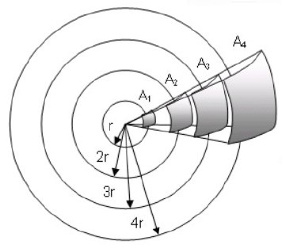

#### Appunti Lezione 5
##### Legge dell'inverso del quadrato
> Mentre l'onda si propaga in forma sferica dalla sorgente, l'intensità sonora diminuisce secondo la legge dell'inverso del quadrato.
in spazi aperti, il suono si propaga in maniera uniforme in tutte le direzioni, questo fa si che più il suono si allontana dalla sorgente, più si sentirà basso, per la precisione se noi andremo a raddoppiare la distanza con la sorgente, il suono verrà propagato in un area triplicata rispetto all'originale, se invece andiamo a triplicare la distannza andremo a propagare il suono su una superficie 9 volte maggiore rispetto a quella iniziale.

Esempio dalle slide
il suono che passa attraverso $A_1 \text {, } A_2 \text {, } A_3 \text {, e } A_4$, come in figura(vedi sotto) che sono 4 superfici di grandezza aumentata proporzionale al quadrato del raggio iniziale, ha esattamente la stessa potenza per tanto il suono sarà più basso man mano che va da una superficie all'altra.

_Limitazioni della legge dell'inverso del quadrato_
- si può applicare solo a sorgenti puntiformi;
- l'energia viene persa anche per l'attrito con il mezzo di trasmissione;

**Esercizio**
Supponiamo di aver percepito un suono con intensità di 90 $\frac{W}{m^2}$ ad una distanza di 5 metri. Quale sarà la sua intensità percepita a distanza di 15 metri?

pre prima cosa calcoliamo il rapporto tra le due distanza conosciute
$\frac{15}{5} = 3$
successivamente calcoliamo il quadrato del rapporto che abbiamo trovato poco prima
$3^2 = 9$
infine andremo a dividere l'intensità originale per la nuova intesità trovata.
$90/9 = 10\frac{W}{m^2}$

per tanto la nuova intensità a 15 metri sarà di 10 $\frac{W}{m^2}$

##### Inviluppo
> è il modo in cui varia l'ampiezza nel tempo.

esistono vari tipi di inviluppo, noi tratteremo l'inviluppo ADSR:
- `A` = Attacco;
> rappresenta l'intervallo di tempo che il suono impiega per passare da ampiezza 0 ad ampiezza massima.
- `D` = Decadimento
> è il momento che l'ampiezza una volta raggiunta il massimo inizia a decadere.
- `S` = Sostenimento
> manteniamo l'ampiezza costante
- `R` = Rilascio
> l'ampiezza cala ritornando a 0

##### Psico-Acustica Curve Isofoniche
poichè è più corretto parlare di volume percepito, sono stati definiti dei grafici che al variare delle della frequenza descrivono tale grandezza, questi vengono chiamati curve isofoniche, danno informazione sull'intensità in dB necessaria per percepire un suono allo stesso volume variando la frequenza, il volume percepito viene descritto dal phon, un essere umano non può sentire suoni inferiori a 0 phon, che per valori di frequenze comprese tra 0 e 1000Hz si comporta come il Decibel SPL, per valori superiore ai 1000 cambia

##### Stereofonia
- ITD Differenza di tempo Interaurale, è la differenza di tempo con cui un suono raggiunge le due orecchie, questa differenza è usata dal cervello umano per determinare la direzione di provenienza del suono.
- IID/ILD Differenza di Intensità Interaurale, è la differenza di volume del suono nelle due orecchie, questa differenza dal cervello umao è usata per determinare la direzione del suono.

##### Grafici utili
- `Spettrogramma/Sonogramma` : è un grafico che mi segna nell'asse y le frequenze ed in quello x il tempo ed in un ipotetico asse z troveremo l'ampiezza.

##### Rumore
> il rumore è un segnale non desiderato e imprevedibile, che sommato ad altri segnali li distorce.

esistono vari tipi di rumori : 
- `Rumore Bianco`(esiste solo teoricamente ed è usato per test, rilassamento o generazione di numeri casuali);
- `Rumore Rosa` (se raddoppiamo la frequenza, l'ampiezza si dimezza, quindi abbiamo un decremento di 3 $dB_{SIL}$ per ottava, viene usato per equalizzare la musica, ricorda il rumore della pioggia);
- `Rumore Brown` (questo nome è dovuto allo scienziato, se raddoppiamo la frequenza, riduciamo l'intensità di $\frac{1}{4} $ , quindi abbiamo un decremento di 6 $dB_{SIL}$, ricorda il rumore delle cascate);
- `Rumore Blu` (in questo rumore avremo un incremento di 3 $dB_{SIL}$ per ottava, al contrario del rumore Rosa, i rumori con questo spettro vengono usati per il Dithering);
- `Rumore viola` (in questo rumore avremo un incremento di 6 $dB_{SIL}$ per ottava, al contrario del rumore Marrone, è adatto per il trattamento degli acufeni);
- `Rumore Grigio` (ogni frequenza di ogni contributo segue le curve isofoniche ed è usato in maniera tale che le frequenze vengano percepite allo stesso volume);

il Timbro di un suono è l'insieme di proprietà che determinano la distinzione di due suoni a parità di ampiezza e frequenza.

##### Appunti Lezione 6
Spettrogramma delle vocali :
per le vocali il valoro delle frequenze formanti vanno dalle frequenze 
`A`: 800-1200
`E`: 400-600 2200-2600
`I`: 200-400 3000-3500
`O`: 400-600
`U`: 200-400

#### Fenomeno psicoacustico : mascheramento delle frequenze
Definizione

> dato un tono mascheratore ed un tono mascherato, si dice mascheramento delle frequenze se i due toni hanno una frequenza simile ed inoltre la frequenza del tono mascheratore deve rendere non udibile il tono mascherato.

l'ampiezza di banda con cui lavorano i filtri uditivi viene detta **banda critica**, ovvero l'intervallo di frequenze all'interno della quale si possono verificare fenomeni di mascheramento.

nel mascheramento delle frequenze riconosciamo due casi studio : 
-   `mascheramento tonale`, un tono copre un'altro tono;
-   `mascheramento non tonale`, viene mascherato con un rumore;

*Termini utili*
- `Test Tone o probe` : il tono che usiamo come riferimento da mascherare.
- `Masking Noise` : maschera di rumore che serve a sovrastare il test tone.
- `Masking Tone` : Maschera tonale che serve a rendere non udibile il test tone.

##### Mascheramento Non Tonale - Rumore Bianco a banda larga
un rumore a banda larga maschera abbastanza uniformemente tutte le frequenze
ogni 10dB di rumore, affinchè il test tone resti udibile deve aumentare anche lui di 10dB

##### Mascheramento Non Tonale - Rumore a banda stretta
nel rumore a banda stretta non è possibile individuare un tono specifico, il mascheramento non tonale impone una soglia più alta, ma è meno efficace per le alte frequenze.

##### Mascheramento Tonale - con un tono Puro
il tono mascheratore è un tono specifico, oppure si fissa l'ampiezza in dB e definiamo così la soglia di mascheramento. il mascheramento tonale con tono puro è più adatto a mascherare le alte frequenze

##### Mascheramento Tonale - con un tono Complesso Semplice(più toni puri distinguibili) - Mascheramento Simultaneo
vedi grafici nelle slide

##### Mascheramento Tonale - Tuning Curve
fissiamo il tono di test e facciamo variare il rumore, per capire quanta energia è richiesta al rumore per superare il tono di test.

##### Mascheramento e Bande Critiche o scala di Bark
le bande critiche sono 24 e hanno tutte grandezze differenti al variare della frequenza, frequenze su bande critiche differenti non interferiscono tra di loro.

Esempio:
per un tono a 2Khz qual'è la sua banda critica?
generiamo un rumore in un'intervallo con 2000 Hz al centro dell'intervallo e raggio variabile, in questo caso abbiamo intensità sonore del suono apprezzabili con rumori aventi larghezza di banda inferiore a 250Hz, quindi la banda critica del segnale a 2KHz è 250Hz

##### Soglia di Mascheramento
è il livello di intensità dove un tono mascherato è ancora udibile in presenza di un tono mascheratore

quantità di energia mascherata : è la differenza tra la soglia di mascheramento e la soglia di udibilità.

##### Temporal Masking Non Simultaneo
abbiamo il tono $T_1$ ad una frequenza x che sta finendo ed un tono $T_2$ ad una frequenza y che attacca poco prima che il tono $T_1$ finisca, se x e y sono due frequenze simili ed il tempo di esistenza multipla dei toni è abbastanza grande allora $T_2$ potrebbe mascherare $T_1$ o viceversa facendo così sentire solo uno dei due toni nel momento di esistenza simultanea dei toni. Il temporal Masking si dice non Simultaneo perchè la sovrapposizione del suono sull'altro avviene quando il primo tono è già finito e quindi in quel momento non sono più simultanei.

##### Fisica e Cognizione

quando noi sentiamo un suono, possiamo riconoscere 2 fasi :

- fase di funzionamento fisiologico
- fase di funzionamento cognitivo.

Funzionamento Fisiologico
> sono tutte quelle funzioni dell'orecchio che ci fanno riconoscere lo spazio intorno a noi, 
fanno comprendere i messaggi che vengono percepiti e fanno capire la natura dell'ambiente.

Funzionamenti Cognitivi
> sono tutte quelle sensazioni che vengono richiamate quando percepiamo un suono conosciuto.

L'orecchio si divide in :
- orecchio esterno:
    > è il padiglione auricolare che serve da imbuto per incanalare i suoni all'interno dell'orecchio.

- orecchio medio: 
    > composto da timpano, martello incudine e staffa che servono ad amplificare le vibrazioni che arrivano al timpano, per impedire la sollecitazione eccessiva del timpano vi è il muscolo stapedio che oltre una certa soglia impedisce la propagazione bloccando gli ossicini.

- orecchio interno:
    > al suo interno abbiamo la Coclea che contiene del liquido e delle cellule chiamate cigliate, il tutto serve a propagare le onde meccaniche dentro l'orecchio più andranno in profondità più basse saranno le frequenze percepite, che saranno poi trasmesse alla corteccia, poi abbiamo la tromba di eustachio, il nervo uditivo e il labirinto quest'ultimo regola l'equilibrio.

il funzionamento dell'orecchio è quello di amplificare la pressione sonora generata dalle onde meccaniche e convertirle in impulsi elettrici, tramite la coclea che si trova nell'orecchio esterno.

N.B. la coclea percepisce le alte frequenze tramite le cellule cigliate che sono poste all'inizio invece le basse frequenze saranno catturate da quelle più interne.